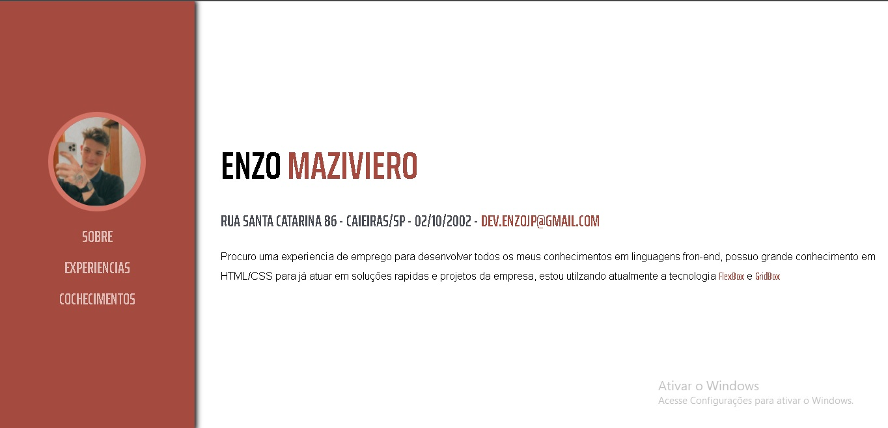
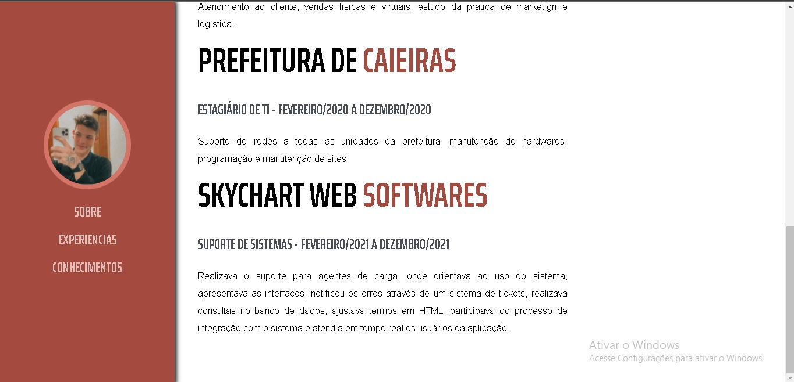
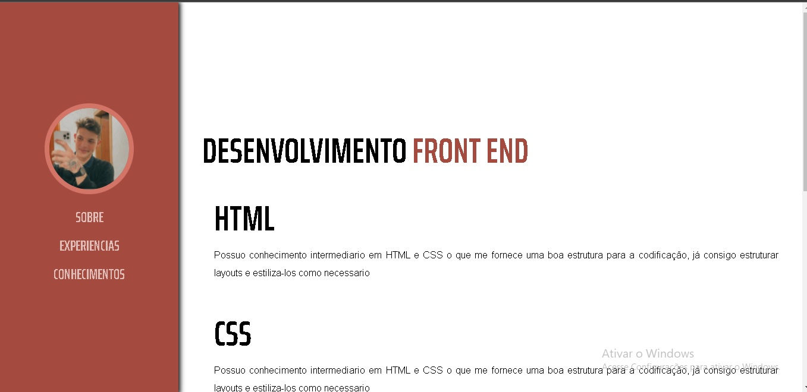

<h1 align="center">Portifolio - Enzo Maziviero</h1>

 Desenvolvi esse template de Portifolio com o intuito de praticar algumas tecnologias que entrei em contato <b> Flex Box </b> e <b> Grid Box </b>.
  
<h2> Status : Em Desenvolvimento </h2>

<h1 align="center">
  
</h1>

 <h2> 🛠 Seção de Conteudos</h2>
 <h2 align="center"> Sobre </h2>
 
Nessa aba está presente informações de contato do desenvolvedor, e um breve resumo dos seus objetivos profissionais no momento

 <h1 align="center">
  
</h1>
 <h2 align="center"> Experiencias </h2>
 
Ao acessar a opção de <b>Experiencias</b> você encontrara todas as experiencias profissionais do desenvolvedor

 <h1 align="center">
  
</h1>
 <h2 align="center"> Conhecimentos </h2>
 
Na ultima opção, chamada <b>Conhecimentos</b> está presente algumas habilidades e conhecimentos do desenvolvedor

 <h1 align="center">
  
</h1>
<h2> 🛠 Tecnologias usadas</h2>
<ul>
 • <a href="#">Html</a> • 
<a href="#">Css</a>
</ul>
